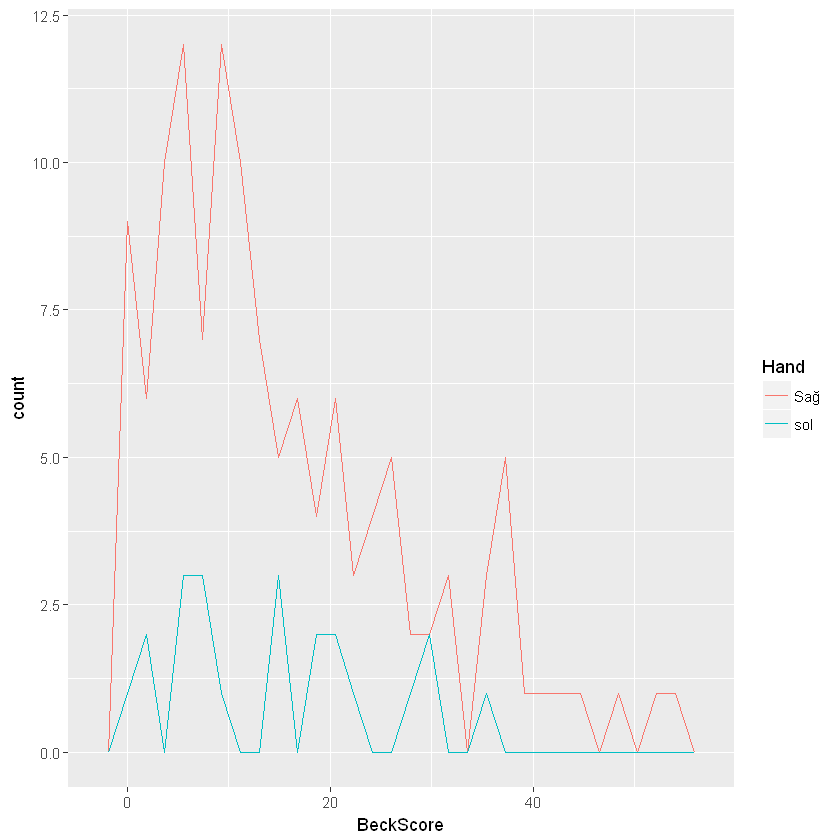
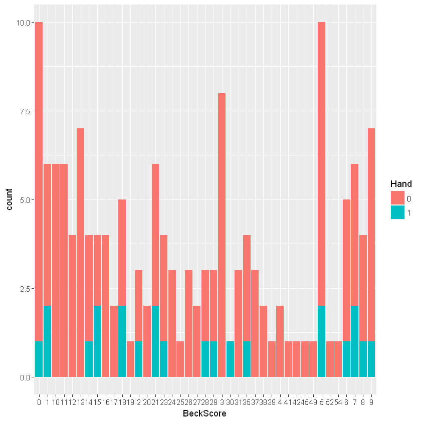

```R
setwd("C:/Work/training/ML")

```


```R
mydata = read.csv('MFA_patient.csv', header=TRUE, stringsAsFactors=FALSE, sep=',')
```


```R
head(mydata)
```


<table>
<thead><tr><th scope=col>ï..HastaNumber</th><th scope=col>Cinsiyet</th><th scope=col>Beck.Skor</th><th scope=col>Dominant.el</th><th scope=col>EÄŸitim.durumu</th><th scope=col>HastalÄ.k.sÃ.resi</th><th scope=col>Liebowitz.skor...KaygÄ..KaÃ.Ä.nma.</th><th scope=col>NÃ.bet.tipi</th><th scope=col>Yas</th></tr></thead>
<tbody>
	<tr><td>1                                   </td><td>E                                   </td><td> 5                                  </td><td>sağ                                </td><td>ilkokul                             </td><td>8 yıl                              </td><td>35+24=59                            </td><td>JTKN                                </td><td>24                                  </td></tr>
	<tr><td>2                                   </td><td>K                                   </td><td>14                                  </td><td>sağ                                </td><td>ilkokul                             </td><td>13 yıl                             </td><td>41+41=82                            </td><td>JTKN                                </td><td>22                                  </td></tr>
	<tr><td>3                                   </td><td>K                                   </td><td>26                                  </td><td>sağ                                </td><td>ilkokul                             </td><td>13 yıl                             </td><td>47+44=91                            </td><td>absans, JTKN                        </td><td>43                                  </td></tr>
	<tr><td>4                                   </td><td>K                                   </td><td> 9                                  </td><td>sol                                 </td><td>ortaokul                            </td><td>3 yıl                              </td><td>44+43=87                            </td><td>sağ fokal motor seconder jeneralize</td><td>52                                  </td></tr>
	<tr><td>5                                   </td><td>E                                   </td><td>19                                  </td><td>sağ                                </td><td>lise                                </td><td>12 yıl                             </td><td>57+51=108                           </td><td>KPN                                 </td><td>25                                  </td></tr>
	<tr><td>6                                   </td><td>E                                   </td><td>27                                  </td><td>sağ                                </td><td>lise                                </td><td>3 yıl                              </td><td>54+53=107                           </td><td>KPN                                 </td><td>27                                  </td></tr>
</tbody>
</table>


```R
names(mydata)<-c("PatientNo","Gender","BeckScore","Hand","education","Duration","Liebowitz","Nobet","Age")

```


```R
head(mydata)

```


<table>
<thead><tr><th scope=col>PatientNo</th><th scope=col>Gender</th><th scope=col>BeckScore</th><th scope=col>Hand</th><th scope=col>education</th><th scope=col>Duration</th><th scope=col>Liebowitz</th><th scope=col>Nobet</th><th scope=col>Age</th></tr></thead>
<tbody>
	<tr><td>1                                   </td><td>E                                   </td><td> 5                                  </td><td>sağ                                </td><td>ilkokul                             </td><td>8 yıl                              </td><td>35+24=59                            </td><td>JTKN                                </td><td>24                                  </td></tr>
	<tr><td>2                                   </td><td>K                                   </td><td>14                                  </td><td>sağ                                </td><td>ilkokul                             </td><td>13 yıl                             </td><td>41+41=82                            </td><td>JTKN                                </td><td>22                                  </td></tr>
	<tr><td>3                                   </td><td>K                                   </td><td>26                                  </td><td>sağ                                </td><td>ilkokul                             </td><td>13 yıl                             </td><td>47+44=91                            </td><td>absans, JTKN                        </td><td>43                                  </td></tr>
	<tr><td>4                                   </td><td>K                                   </td><td> 9                                  </td><td>sol                                 </td><td>ortaokul                            </td><td>3 yıl                              </td><td>44+43=87                            </td><td>sağ fokal motor seconder jeneralize</td><td>52                                  </td></tr>
	<tr><td>5                                   </td><td>E                                   </td><td>19                                  </td><td>sağ                                </td><td>lise                                </td><td>12 yıl                             </td><td>57+51=108                           </td><td>KPN                                 </td><td>25                                  </td></tr>
	<tr><td>6                                   </td><td>E                                   </td><td>27                                  </td><td>sağ                                </td><td>lise                                </td><td>3 yıl                              </td><td>54+53=107                           </td><td>KPN                                 </td><td>27                                  </td></tr>
</tbody>
</table>


```R
mydata[mydata[,"Hand"]=="saÄŸ","Hand"]<-"Sağ"
```


```R
class(mydata[,"Hand"])
```


'character'


```R
str(mydata[,"Hand"])
```

     chr [1:150] "Sağ" "Sağ" "Sağ" "sol" "Sağ" "Sağ" "Sağ" "Sağ" "sol" "Sağ" ...
    


```R
summary(mydata)
```


       PatientNo         Gender            BeckScore         Hand          
     Min.   :  1.00   Length:150         Min.   : 0.00   Length:150        
     1st Qu.: 38.25   Class :character   1st Qu.: 5.25   Class :character  
     Median :116.50   Mode  :character   Median :12.00   Mode  :character  
     Mean   :104.83                      Mean   :15.19                     
     3rd Qu.:153.75                      3rd Qu.:23.00                     
     Max.   :191.00                      Max.   :54.00                     
      education           Duration          Liebowitz            Nobet          
     Length:150         Length:150         Length:150         Length:150        
     Class :character   Class :character   Class :character   Class :character  
     Mode  :character   Mode  :character   Mode  :character   Mode  :character  
                                                                                
                                                                                
                                                                                
          Age       
     Min.   :18.00  
     1st Qu.:25.00  
     Median :32.00  
     Mean   :34.17  
     3rd Qu.:43.00  
     Max.   :66.00  


```R
# shapiro.test(mydata[mydata[,"Gender"]=="K","BeckScore"])
shapiro.test(mydata[,"BeckScore"])
shapiro.test(mydata[mydata[,"Gender"]=="E","BeckScore"])
shapiro.test(mydata[mydata[,"Gender"]=="K","BeckScore"])

```


    
    	Shapiro-Wilk normality test
    
    data:  mydata[, "BeckScore"]
    W = 0.91899, p-value = 1.828e-07
    


    
    	Shapiro-Wilk normality test
    
    data:  mydata[mydata[, "Gender"] == "E", "BeckScore"]
    W = 0.90722, p-value = 0.0003961
    


    
    	Shapiro-Wilk normality test
    
    data:  mydata[mydata[, "Gender"] == "K", "BeckScore"]
    W = 0.91348, p-value = 1.153e-05
    


```R
if(!require("ggplot2", quietly = TRUE)) install.packages("ggplot2",repos='http://cran.us.r-project.org')
library(ggplot2, quietly = TRUE)
```


```R
g<-ggplot(mydata, aes(BeckScore,colour= Hand))
g + geom_freqpoly()
```

    `stat_bin()` using `bins = 30`. Pick better value with `binwidth`.
    





```R
mydata[,2]<-factor(mydata[,2])
mydata[,2]
```


<ol class=list-inline>
	<li>E</li>
	<li>K</li>
	<li>K</li>
	<li>K</li>
	<li>E</li>
	<li>E</li>
	<li>E</li>
	<li>E</li>
	<li>K</li>
	<li>K</li>
	<li>K</li>
	<li>K</li>
	<li>K</li>
	<li>K</li>
	<li>K</li>
	<li>K</li>
	<li>E</li>
	<li>K</li>
	<li>K</li>
	<li>K</li>
	<li>E</li>
	<li>E</li>
	<li>K</li>
	<li>K</li>
	<li>K</li>
	<li>E</li>
	<li>K</li>
	<li>E</li>
	<li>E</li>
	<li>K</li>
	<li>E</li>
	<li>K</li>
	<li>K</li>
	<li>K</li>
	<li>K</li>
	<li>K</li>
	<li>K</li>
	<li>E</li>
	<li>K</li>
	<li>E</li>
	<li>E</li>
	<li>K</li>
	<li>E</li>
	<li>K</li>
	<li>K</li>
	<li>K</li>
	<li>E</li>
	<li>K</li>
	<li>K</li>
	<li>E</li>
	<li>E</li>
	<li>K</li>
	<li>E</li>
	<li>E</li>
	<li>E</li>
	<li>E</li>
	<li>K</li>
	<li>E</li>
	<li>K</li>
	<li>K</li>
	<li>E</li>
	<li>E</li>
	<li>E</li>
	<li>E</li>
	<li>E</li>
	<li>E</li>
	<li>K</li>
	<li>E</li>
	<li>K</li>
	<li>K</li>
	<li>K</li>
	<li>E</li>
	<li>E</li>
	<li>K</li>
	<li>K</li>
	<li>K</li>
	<li>K</li>
	<li>K</li>
	<li>K</li>
	<li>K</li>
	<li>E</li>
	<li>E</li>
	<li>K</li>
	<li>E</li>
	<li>E</li>
	<li>K</li>
	<li>E</li>
	<li>K</li>
	<li>K</li>
	<li>K</li>
	<li>E</li>
	<li>E</li>
	<li>K</li>
	<li>K</li>
	<li>K</li>
	<li>E</li>
	<li>K</li>
	<li>K</li>
	<li>E</li>
	<li>K</li>
	<li>E</li>
	<li>E</li>
	<li>K</li>
	<li>K</li>
	<li>E</li>
	<li>E</li>
	<li>K</li>
	<li>E</li>
	<li>K</li>
	<li>K</li>
	<li>K</li>
	<li>K</li>
	<li>K</li>
	<li>K</li>
	<li>K</li>
	<li>E</li>
	<li>K</li>
	<li>K</li>
	<li>K</li>
	<li>K</li>
	<li>K</li>
	<li>K</li>
	<li>E</li>
	<li>K</li>
	<li>K</li>
	<li>K</li>
	<li>K</li>
	<li>K</li>
	<li>K</li>
	<li>K</li>
	<li>E</li>
	<li>K</li>
	<li>K</li>
	<li>K</li>
	<li>E</li>
	<li>K</li>
	<li>K</li>
	<li>K</li>
	<li>E</li>
	<li>E</li>
	<li>E</li>
	<li>K</li>
	<li>K</li>
	<li>K</li>
	<li>K</li>
	<li>E</li>
	<li>K</li>
	<li>K</li>
	<li>K</li>
	<li>E</li>
</ol>


```R
summary(mydata)
```


      PatientNo             Gender   BeckScore         Hand    education
     Length:151         Min.   :1   Length:151         0:128   0: 1     
     Class :character   1st Qu.:1   Class :character   1: 23   1:53     
     Mode  :character   Median :1   Mode  :character           2:21     
                        Mean   :1                              3:43     
                        3rd Qu.:1                              4:33     
                        Max.   :1                                       
       Duration          Liebowitz            Nobet               Age           
     Length:151         Length:151         Length:151         Length:151        
     Class :character   Class :character   Class :character   Class :character  
     Mode  :character   Mode  :character   Mode  :character   Mode  :character  
                                                                                
                                                                                
                                                                                


```R
mydata[,"Gender"]<-factor(mydata[,"Gender"],labels=c(0,1))
```


```R
mydata[,"Gender"]
```


<ol class=list-inline>
	<li>0</li>
	<li>1</li>
	<li>1</li>
	<li>1</li>
	<li>0</li>
	<li>0</li>
	<li>0</li>
	<li>0</li>
	<li>1</li>
	<li>1</li>
	<li>1</li>
	<li>1</li>
	<li>1</li>
	<li>1</li>
	<li>1</li>
	<li>1</li>
	<li>0</li>
	<li>1</li>
	<li>1</li>
	<li>1</li>
	<li>0</li>
	<li>0</li>
	<li>1</li>
	<li>1</li>
	<li>1</li>
	<li>0</li>
	<li>1</li>
	<li>0</li>
	<li>0</li>
	<li>1</li>
	<li>0</li>
	<li>1</li>
	<li>1</li>
	<li>1</li>
	<li>1</li>
	<li>1</li>
	<li>1</li>
	<li>0</li>
	<li>1</li>
	<li>0</li>
	<li>0</li>
	<li>1</li>
	<li>0</li>
	<li>1</li>
	<li>1</li>
	<li>1</li>
	<li>0</li>
	<li>1</li>
	<li>1</li>
	<li>0</li>
	<li>0</li>
	<li>1</li>
	<li>0</li>
	<li>0</li>
	<li>0</li>
	<li>0</li>
	<li>1</li>
	<li>0</li>
	<li>1</li>
	<li>1</li>
	<li>0</li>
	<li>0</li>
	<li>0</li>
	<li>0</li>
	<li>0</li>
	<li>0</li>
	<li>1</li>
	<li>0</li>
	<li>1</li>
	<li>1</li>
	<li>1</li>
	<li>0</li>
	<li>0</li>
	<li>1</li>
	<li>1</li>
	<li>1</li>
	<li>1</li>
	<li>1</li>
	<li>1</li>
	<li>1</li>
	<li>0</li>
	<li>0</li>
	<li>1</li>
	<li>0</li>
	<li>0</li>
	<li>1</li>
	<li>0</li>
	<li>1</li>
	<li>1</li>
	<li>1</li>
	<li>0</li>
	<li>0</li>
	<li>1</li>
	<li>1</li>
	<li>1</li>
	<li>0</li>
	<li>1</li>
	<li>1</li>
	<li>0</li>
	<li>1</li>
	<li>0</li>
	<li>0</li>
	<li>1</li>
	<li>1</li>
	<li>0</li>
	<li>0</li>
	<li>1</li>
	<li>0</li>
	<li>1</li>
	<li>1</li>
	<li>1</li>
	<li>1</li>
	<li>1</li>
	<li>1</li>
	<li>1</li>
	<li>0</li>
	<li>1</li>
	<li>1</li>
	<li>1</li>
	<li>1</li>
	<li>1</li>
	<li>1</li>
	<li>0</li>
	<li>1</li>
	<li>1</li>
	<li>1</li>
	<li>1</li>
	<li>1</li>
	<li>1</li>
	<li>1</li>
	<li>0</li>
	<li>1</li>
	<li>1</li>
	<li>1</li>
	<li>0</li>
	<li>1</li>
	<li>1</li>
	<li>1</li>
	<li>0</li>
	<li>0</li>
	<li>0</li>
	<li>1</li>
	<li>1</li>
	<li>1</li>
	<li>1</li>
	<li>0</li>
	<li>1</li>
	<li>1</li>
	<li>1</li>
	<li>0</li>
</ol>


```R
summary(mydata)
```


       PatientNo      Gender   BeckScore         Hand            education        
     Min.   :  1.00   0:56   Min.   : 0.00   Length:150         Length:150        
     1st Qu.: 38.25   1:94   1st Qu.: 5.25   Class :character   Class :character  
     Median :116.50          Median :12.00   Mode  :character   Mode  :character  
     Mean   :104.83          Mean   :15.19                                        
     3rd Qu.:153.75          3rd Qu.:23.00                                        
     Max.   :191.00          Max.   :54.00                                        
       Duration          Liebowitz            Nobet                Age       
     Length:150         Length:150         Length:150         Min.   :18.00  
     Class :character   Class :character   Class :character   1st Qu.:25.00  
     Mode  :character   Mode  :character   Mode  :character   Median :32.00  
                                                              Mean   :34.17  
                                                              3rd Qu.:43.00  
                                                              Max.   :66.00  


```R
mydata[,"Hand"]<- factor(mydata[,"Hand"],labels=c(0,1))
mydata[,"Hand"]
```


<ol class=list-inline>
	<li>0</li>
	<li>0</li>
	<li>0</li>
	<li>1</li>
	<li>0</li>
	<li>0</li>
	<li>0</li>
	<li>0</li>
	<li>1</li>
	<li>0</li>
	<li>0</li>
	<li>0</li>
	<li>0</li>
	<li>1</li>
	<li>0</li>
	<li>0</li>
	<li>0</li>
	<li>0</li>
	<li>0</li>
	<li>1</li>
	<li>0</li>
	<li>0</li>
	<li>0</li>
	<li>0</li>
	<li>0</li>
	<li>1</li>
	<li>0</li>
	<li>0</li>
	<li>0</li>
	<li>0</li>
	<li>0</li>
	<li>0</li>
	<li>0</li>
	<li>1</li>
	<li>1</li>
	<li>0</li>
	<li>1</li>
	<li>0</li>
	<li>0</li>
	<li>0</li>
	<li>1</li>
	<li>0</li>
	<li>0</li>
	<li>0</li>
	<li>0</li>
	<li>1</li>
	<li>0</li>
	<li>0</li>
	<li>0</li>
	<li>0</li>
	<li>0</li>
	<li>1</li>
	<li>0</li>
	<li>0</li>
	<li>0</li>
	<li>0</li>
	<li>1</li>
	<li>0</li>
	<li>0</li>
	<li>0</li>
	<li>0</li>
	<li>1</li>
	<li>0</li>
	<li>0</li>
	<li>0</li>
	<li>1</li>
	<li>1</li>
	<li>0</li>
	<li>0</li>
	<li>0</li>
	<li>0</li>
	<li>0</li>
	<li>0</li>
	<li>0</li>
	<li>0</li>
	<li>1</li>
	<li>0</li>
	<li>0</li>
	<li>0</li>
	<li>0</li>
	<li>0</li>
	<li>0</li>
	<li>0</li>
	<li>0</li>
	<li>0</li>
	<li>0</li>
	<li>0</li>
	<li>0</li>
	<li>0</li>
	<li>1</li>
	<li>0</li>
	<li>0</li>
	<li>0</li>
	<li>0</li>
	<li>0</li>
	<li>1</li>
	<li>0</li>
	<li>0</li>
	<li>0</li>
	<li>0</li>
	<li>0</li>
	<li>0</li>
	<li>0</li>
	<li>0</li>
	<li>0</li>
	<li>0</li>
	<li>0</li>
	<li>0</li>
	<li>0</li>
	<li>0</li>
	<li>0</li>
	<li>0</li>
	<li>1</li>
	<li>0</li>
	<li>1</li>
	<li>0</li>
	<li>0</li>
	<li>0</li>
	<li>0</li>
	<li>0</li>
	<li>0</li>
	<li>0</li>
	<li>0</li>
	<li>0</li>
	<li>0</li>
	<li>0</li>
	<li>0</li>
	<li>0</li>
	<li>0</li>
	<li>0</li>
	<li>0</li>
	<li>1</li>
	<li>0</li>
	<li>0</li>
	<li>0</li>
	<li>0</li>
	<li>0</li>
	<li>0</li>
	<li>0</li>
	<li>0</li>
	<li>0</li>
	<li>0</li>
	<li>0</li>
	<li>0</li>
	<li>0</li>
	<li>0</li>
	<li>0</li>
	<li>1</li>
	<li>0</li>
	<li>0</li>
</ol>


```R
mydata
```


<table>
<thead><tr><th scope=col>PatientNo</th><th scope=col>Gender</th><th scope=col>BeckScore</th><th scope=col>Hand</th><th scope=col>education</th><th scope=col>Duration</th><th scope=col>Liebowitz</th><th scope=col>Nobet</th><th scope=col>Age</th></tr></thead>
<tbody>
	<tr><td> 1                                  </td><td>0                                   </td><td> 5                                  </td><td>0                                   </td><td>ilkokul                             </td><td>8 yıl                              </td><td>35+24=59                            </td><td>JTKN                                </td><td>24                                  </td></tr>
	<tr><td> 2                                  </td><td>1                                   </td><td>14                                  </td><td>0                                   </td><td>ilkokul                             </td><td>13 yıl                             </td><td>41+41=82                            </td><td>JTKN                                </td><td>22                                  </td></tr>
	<tr><td> 3                                  </td><td>1                                   </td><td>26                                  </td><td>0                                   </td><td>ilkokul                             </td><td>13 yıl                             </td><td>47+44=91                            </td><td>absans, JTKN                        </td><td>43                                  </td></tr>
	<tr><td> 4                                  </td><td>1                                   </td><td> 9                                  </td><td>1                                   </td><td>ortaokul                            </td><td>3 yıl                              </td><td>44+43=87                            </td><td>sağ fokal motor seconder jeneralize</td><td>52                                  </td></tr>
	<tr><td> 5                                  </td><td>0                                   </td><td>19                                  </td><td>0                                   </td><td>lise                                </td><td>12 yıl                             </td><td>57+51=108                           </td><td>KPN                                 </td><td>25                                  </td></tr>
	<tr><td> 6                                  </td><td>0                                   </td><td>27                                  </td><td>0                                   </td><td>lise                                </td><td>3 yıl                              </td><td>54+53=107                           </td><td>KPN                                 </td><td>27                                  </td></tr>
	<tr><td> 7                                  </td><td>0                                   </td><td>11                                  </td><td>0                                   </td><td>ilkokul                             </td><td>17 yıl                             </td><td>32+27=59                            </td><td>KPN                                 </td><td>45                                  </td></tr>
	<tr><td> 8                                  </td><td>0                                   </td><td>38                                  </td><td>0                                   </td><td>ilkokul                             </td><td>10 yıl                             </td><td>42+37=79                            </td><td>Absans, KPN                         </td><td>31                                  </td></tr>
	<tr><td> 9                                  </td><td>1                                   </td><td>18                                  </td><td>1                                   </td><td>ortaokul                            </td><td>3 yıl                              </td><td>33+29=62                            </td><td>JTKN                                </td><td>23                                  </td></tr>
	<tr><td>10                                  </td><td>1                                   </td><td>45                                  </td><td>0                                   </td><td>ilkokul                             </td><td>22 yıl                             </td><td>66+61=127                           </td><td>KPN                                 </td><td>35                                  </td></tr>
	<tr><td>11                                  </td><td>1                                   </td><td>13                                  </td><td>0                                   </td><td>lise                                </td><td>4 yıl                              </td><td>35+28=63                            </td><td>JTKN                                </td><td>23                                  </td></tr>
	<tr><td>12                                  </td><td>1                                   </td><td> 9                                  </td><td>0                                   </td><td>üniversite                         </td><td>26 yıl                             </td><td>31+29=60                            </td><td>JTKN                                </td><td>43                                  </td></tr>
	<tr><td>13                                  </td><td>1                                   </td><td>21                                  </td><td>0                                   </td><td>üniversite                         </td><td>5 yıl                              </td><td>27+27=54                            </td><td>JTKN                                </td><td>30                                  </td></tr>
	<tr><td>14                                  </td><td>1                                   </td><td> 2                                  </td><td>1                                   </td><td>lise                                </td><td>42 yıl                             </td><td>34+30=64                            </td><td>KPN                                 </td><td>49                                  </td></tr>
	<tr><td>15                                  </td><td>1                                   </td><td> 0                                  </td><td>0                                   </td><td>ortaokul                            </td><td>6 yıl                              </td><td>34+30=63                            </td><td>JTKN                                </td><td>36                                  </td></tr>
	<tr><td>16                                  </td><td>1                                   </td><td>54                                  </td><td>0                                   </td><td>lise                                </td><td>8 yıl                              </td><td>33+30=136                           </td><td>JTKN                                </td><td>23                                  </td></tr>
	<tr><td>17                                  </td><td>0                                   </td><td>14                                  </td><td>0                                   </td><td>ilkokul                             </td><td>12 yıl                             </td><td>71+65=98                            </td><td>JTKN                                </td><td>47                                  </td></tr>
	<tr><td>18                                  </td><td>1                                   </td><td>20                                  </td><td>0                                   </td><td>ilkokul                             </td><td>17 yıl                             </td><td>47+46=93                            </td><td>JTKN                                </td><td>23                                  </td></tr>
	<tr><td>19                                  </td><td>1                                   </td><td>25                                  </td><td>0                                   </td><td>üniversite                         </td><td>2 yıl                              </td><td>52+49=101                           </td><td>sağ fokal motor                    </td><td>30                                  </td></tr>
	<tr><td>20                                  </td><td>1                                   </td><td>35                                  </td><td>1                                   </td><td>üniversite                         </td><td>1 yıl                              </td><td>57+63=120                           </td><td>JTKN                                </td><td>35                                  </td></tr>
	<tr><td>21                                  </td><td>0                                   </td><td>17                                  </td><td>0                                   </td><td>ilkokul                             </td><td>20 yıl                             </td><td>32+36=68                            </td><td>JTKN                                </td><td>40                                  </td></tr>
	<tr><td>22                                  </td><td>0                                   </td><td>31                                  </td><td>0                                   </td><td>ilkokul                             </td><td>5 yıl                              </td><td>47+52=99                            </td><td>sol fokal motor                     </td><td>30                                  </td></tr>
	<tr><td>23                                  </td><td>1                                   </td><td>13                                  </td><td>0                                   </td><td>lise                                </td><td>8 yıl                              </td><td>65+65=130                           </td><td>fokal nöbet                        </td><td>22                                  </td></tr>
	<tr><td>24                                  </td><td>1                                   </td><td> 3                                  </td><td>0                                   </td><td>üniversite                         </td><td>17 yıl                             </td><td>40+32=72                            </td><td>JTKN                                </td><td>24                                  </td></tr>
	<tr><td>25                                  </td><td>1                                   </td><td>52                                  </td><td>0                                   </td><td>ilkokul                             </td><td>40 yıl                             </td><td>24+24=48                            </td><td>sol fokal motor                     </td><td>42                                  </td></tr>
	<tr><td>26                                  </td><td>0                                   </td><td>21                                  </td><td>1                                   </td><td>ortaokul                            </td><td>3 yıl                              </td><td>58+59=117                           </td><td>sol fokal motor                     </td><td>43                                  </td></tr>
	<tr><td>27                                  </td><td>1                                   </td><td>29                                  </td><td>0                                   </td><td>ilkokul                             </td><td>6 yıl                              </td><td>45+29=74                            </td><td>JTKN                                </td><td>36                                  </td></tr>
	<tr><td>28                                  </td><td>0                                   </td><td> 6                                  </td><td>0                                   </td><td>lise                                </td><td>5 yıl                              </td><td>38+31=69                            </td><td>JTKN                                </td><td>24                                  </td></tr>
	<tr><td>29                                  </td><td>0                                   </td><td>21                                  </td><td>0                                   </td><td>üniversite                         </td><td>11yıl                              </td><td>55+58=113                           </td><td>JTKN                                </td><td>34                                  </td></tr>
	<tr><td>30                                  </td><td>1                                   </td><td>10                                  </td><td>0                                   </td><td>üniversite                         </td><td>5 yıl                              </td><td>33+31=64                            </td><td>JTKN                                </td><td>35                                  </td></tr>
	<tr><td>...</td><td>...</td><td>...</td><td>...</td><td>...</td><td>...</td><td>...</td><td>...</td><td>...</td></tr>
	<tr><td>162            </td><td>1              </td><td> 1             </td><td>0              </td><td>üniversite    </td><td>12 yıl        </td><td>24+24=48       </td><td>JTKN           </td><td>34             </td></tr>
	<tr><td>163            </td><td>1              </td><td> 3             </td><td>0              </td><td>ilkokul        </td><td>14 yıl        </td><td>50+51=101      </td><td>JTKN           </td><td>46             </td></tr>
	<tr><td>164            </td><td>0              </td><td>21             </td><td>0              </td><td>ilkokul        </td><td>37 yıl        </td><td>56+41=97       </td><td>JTKN           </td><td>51             </td></tr>
	<tr><td>165            </td><td>1              </td><td>24             </td><td>0              </td><td>lise           </td><td>17 yıl        </td><td>49+46=95       </td><td>JTKN           </td><td>39             </td></tr>
	<tr><td>166            </td><td>1              </td><td> 6             </td><td>0              </td><td>lise           </td><td>13 yıl        </td><td>28+27=55       </td><td>JTKN           </td><td>53             </td></tr>
	<tr><td>167            </td><td>1              </td><td>41             </td><td>0              </td><td>lise           </td><td>17 yıl        </td><td>48+43=91       </td><td>JTKN           </td><td>24             </td></tr>
	<tr><td>168            </td><td>1              </td><td> 5             </td><td>0              </td><td>ilkokul        </td><td>2 yıl         </td><td>41+24=65       </td><td>JTKN           </td><td>44             </td></tr>
	<tr><td>169            </td><td>1              </td><td>11             </td><td>0              </td><td>ilkokul        </td><td>14 yıl        </td><td>55+39=94       </td><td>JTKN           </td><td>44             </td></tr>
	<tr><td>170            </td><td>1              </td><td>24             </td><td>0              </td><td>ilkokul        </td><td>5 ay           </td><td>72+75=147      </td><td>JTKN           </td><td>24             </td></tr>
	<tr><td>171            </td><td>1              </td><td> 3             </td><td>0              </td><td>ilkokul        </td><td>16 yıl        </td><td>43+34=77       </td><td>JTKN           </td><td>43             </td></tr>
	<tr><td>172            </td><td>0              </td><td>23             </td><td>0              </td><td>ilkokul        </td><td>15 yıl        </td><td>93+76=169      </td><td>JTKN           </td><td>56             </td></tr>
	<tr><td>173            </td><td>1              </td><td>21             </td><td>1              </td><td>ortaokul       </td><td>19 yıl        </td><td>42+39=81       </td><td>JTKN           </td><td>22             </td></tr>
	<tr><td>174            </td><td>1              </td><td> 1             </td><td>0              </td><td>üniversite    </td><td>8 yıl         </td><td>25+24=49       </td><td>JTKN           </td><td>22             </td></tr>
	<tr><td>175            </td><td>1              </td><td>39             </td><td>0              </td><td>lise           </td><td>5 yıl         </td><td>59+58=117      </td><td>JTKN           </td><td>25             </td></tr>
	<tr><td>176            </td><td>0              </td><td>18             </td><td>0              </td><td>lise           </td><td>2 yıl         </td><td>55+39=94       </td><td>JTKN           </td><td>33             </td></tr>
	<tr><td>177            </td><td>1              </td><td>35             </td><td>0              </td><td>ilkokul        </td><td>20 yıl        </td><td>74+71=145      </td><td>JTKN           </td><td>32             </td></tr>
	<tr><td>178            </td><td>1              </td><td>14             </td><td>0              </td><td>lise           </td><td>5 ay           </td><td>43+26=69       </td><td>JTKN           </td><td>20             </td></tr>
	<tr><td>179            </td><td>1              </td><td>15             </td><td>0              </td><td>üniversite    </td><td>37 yıl        </td><td>30+24=54       </td><td>JTKN           </td><td>61             </td></tr>
	<tr><td>180            </td><td>0              </td><td> 6             </td><td>0              </td><td>üniversite    </td><td>18 yıl        </td><td>33+26=59       </td><td>JTKN           </td><td>53             </td></tr>
	<tr><td>181            </td><td>0              </td><td>38             </td><td>0              </td><td>lise           </td><td>1 yıl         </td><td>32+24=56       </td><td>KPN            </td><td>59             </td></tr>
	<tr><td>182            </td><td>0              </td><td> 7             </td><td>0              </td><td>lise           </td><td>23 yıl        </td><td>35+24=59       </td><td>miyoklonik jerk</td><td>26             </td></tr>
	<tr><td>183            </td><td>1              </td><td>12             </td><td>0              </td><td>üniversite    </td><td>13 yıl        </td><td>33+25=58       </td><td>JTKN           </td><td>27             </td></tr>
	<tr><td>184            </td><td>1              </td><td> 7             </td><td>0              </td><td>üniversite    </td><td>17 yıl        </td><td>39+26=65       </td><td>JTKN           </td><td>30             </td></tr>
	<tr><td>185            </td><td>1              </td><td> 5             </td><td>0              </td><td>ilkokul        </td><td>30 yıl        </td><td>40+25=65       </td><td>KPN            </td><td>44             </td></tr>
	<tr><td>186            </td><td>1              </td><td> 8             </td><td>0              </td><td>ilkokul        </td><td>8 yıl         </td><td>43+24=67       </td><td>KPN            </td><td>24             </td></tr>
	<tr><td>187            </td><td>0              </td><td> 0             </td><td>0              </td><td>üniversite    </td><td>8 yıl         </td><td>39+33=72       </td><td>JTKN           </td><td>22             </td></tr>
	<tr><td>188            </td><td>1              </td><td>13             </td><td>0              </td><td>ortaokul       </td><td>1,5 yıl       </td><td>72+39=111      </td><td>JTKN           </td><td>20             </td></tr>
	<tr><td>189            </td><td>1              </td><td> 0             </td><td>1              </td><td>ilkokul        </td><td>3 yıl         </td><td>52+46=98       </td><td>JTKN           </td><td>26             </td></tr>
	<tr><td>190            </td><td>1              </td><td> 0             </td><td>0              </td><td>lise           </td><td>6 yıl         </td><td>42+33=75       </td><td>JTKN           </td><td>19             </td></tr>
	<tr><td>191            </td><td>0              </td><td> 1             </td><td>0              </td><td>üniversite    </td><td>1 yıl         </td><td>24+24=48       </td><td>JTKN           </td><td>19             </td></tr>
</tbody>
</table>


```R
mydata[,"education"] <- factor(mydata[,"education"],levels=c("okuryazar","ilkokul","ortaokul","lise","üniversite"),labels=c(0,1,2,3,4),ordered =TRUE)
mydata[,"education"]
```


<ol class=list-inline>
	<li>1</li>
	<li>1</li>
	<li>1</li>
	<li>2</li>
	<li>3</li>
	<li>3</li>
	<li>1</li>
	<li>1</li>
	<li>2</li>
	<li>1</li>
	<li>3</li>
	<li>4</li>
	<li>4</li>
	<li>3</li>
	<li>2</li>
	<li>3</li>
	<li>1</li>
	<li>1</li>
	<li>4</li>
	<li>4</li>
	<li>1</li>
	<li>1</li>
	<li>3</li>
	<li>4</li>
	<li>1</li>
	<li>2</li>
	<li>1</li>
	<li>3</li>
	<li>4</li>
	<li>4</li>
	<li>2</li>
	<li>4</li>
	<li>3</li>
	<li>1</li>
	<li>3</li>
	<li>1</li>
	<li>3</li>
	<li>1</li>
	<li>1</li>
	<li>4</li>
	<li>4</li>
	<li>1</li>
	<li>2</li>
	<li>2</li>
	<li>1</li>
	<li>4</li>
	<li>1</li>
	<li>3</li>
	<li>3</li>
	<li>2</li>
	<li>4</li>
	<li>1</li>
	<li>1</li>
	<li>4</li>
	<li>1</li>
	<li>3</li>
	<li>3</li>
	<li>2</li>
	<li>1</li>
	<li>3</li>
	<li>1</li>
	<li>0</li>
	<li>2</li>
	<li>3</li>
	<li>3</li>
	<li>1</li>
	<li>3</li>
	<li>3</li>
	<li>2</li>
	<li>1</li>
	<li>1</li>
	<li>4</li>
	<li>3</li>
	<li>3</li>
	<li>1</li>
	<li>3</li>
	<li>1</li>
	<li>4</li>
	<li>1</li>
	<li>2</li>
	<li>3</li>
	<li>2</li>
	<li>3</li>
	<li>4</li>
	<li>2</li>
	<li>1</li>
	<li>3</li>
	<li>3</li>
	<li>4</li>
	<li>2</li>
	<li>4</li>
	<li>3</li>
	<li>4</li>
	<li>1</li>
	<li>1</li>
	<li>2</li>
	<li>3</li>
	<li>1</li>
	<li>4</li>
	<li>1</li>
	<li>3</li>
	<li>4</li>
	<li>3</li>
	<li>1</li>
	<li>2</li>
	<li>1</li>
	<li>4</li>
	<li>4</li>
	<li>4</li>
	<li>4</li>
	<li>2</li>
	<li>3</li>
	<li>3</li>
	<li>1</li>
	<li>2</li>
	<li>3</li>
	<li>1</li>
	<li>3</li>
	<li>1</li>
	<li>1</li>
	<li>4</li>
	<li>1</li>
	<li>1</li>
	<li>3</li>
	<li>3</li>
	<li>3</li>
	<li>1</li>
	<li>1</li>
	<li>1</li>
	<li>1</li>
	<li>1</li>
	<li>2</li>
	<li>4</li>
	<li>3</li>
	<li>3</li>
	<li>1</li>
	<li>3</li>
	<li>4</li>
	<li>4</li>
	<li>3</li>
	<li>3</li>
	<li>4</li>
	<li>4</li>
	<li>1</li>
	<li>1</li>
	<li>4</li>
	<li>2</li>
	<li>1</li>
	<li>3</li>
	<li>4</li>
</ol>


```R
head(mydata)
```


<table>
<thead><tr><th scope=col>PatientNo</th><th scope=col>Gender</th><th scope=col>BeckScore</th><th scope=col>Hand</th><th scope=col>education</th><th scope=col>Duration</th><th scope=col>Liebowitz</th><th scope=col>Nobet</th><th scope=col>Age</th></tr></thead>
<tbody>
	<tr><td>1                                   </td><td>0                                   </td><td> 5                                  </td><td>0                                   </td><td>1                                   </td><td>8 yıl                              </td><td>35+24=59                            </td><td>JTKN                                </td><td>24                                  </td></tr>
	<tr><td>2                                   </td><td>1                                   </td><td>14                                  </td><td>0                                   </td><td>1                                   </td><td>13 yıl                             </td><td>41+41=82                            </td><td>JTKN                                </td><td>22                                  </td></tr>
	<tr><td>3                                   </td><td>1                                   </td><td>26                                  </td><td>0                                   </td><td>1                                   </td><td>13 yıl                             </td><td>47+44=91                            </td><td>absans, JTKN                        </td><td>43                                  </td></tr>
	<tr><td>4                                   </td><td>1                                   </td><td> 9                                  </td><td>1                                   </td><td>2                                   </td><td>3 yıl                              </td><td>44+43=87                            </td><td>sağ fokal motor seconder jeneralize</td><td>52                                  </td></tr>
	<tr><td>5                                   </td><td>0                                   </td><td>19                                  </td><td>0                                   </td><td>3                                   </td><td>12 yıl                             </td><td>57+51=108                           </td><td>KPN                                 </td><td>25                                  </td></tr>
	<tr><td>6                                   </td><td>0                                   </td><td>27                                  </td><td>0                                   </td><td>3                                   </td><td>3 yıl                              </td><td>54+53=107                           </td><td>KPN                                 </td><td>27                                  </td></tr>
</tbody>
</table>


```R
install.packages('corrplot', repos='http://cran.us.r-project.org')
library(corrplot)


```

    package 'corrplot' successfully unpacked and MD5 sums checked
    
    The downloaded binary packages are in
    	C:\Users\saygina\AppData\Local\Temp\RtmpsTQ9gw\downloaded_packages
    

    Warning message:
    "package 'corrplot' was built under R version 3.4.3"corrplot 0.84 loaded
    


```R
summary(mydata)

```


       PatientNo      Gender   BeckScore     Hand    education   Duration        
     Min.   :  1.00   0:56   Min.   : 0.00   0:128   0: 1      Length:150        
     1st Qu.: 38.25   1:94   1st Qu.: 5.25   1: 22   1:52      Class :character  
     Median :116.50          Median :12.00           2:21      Mode  :character  
     Mean   :104.83          Mean   :15.19           3:43                        
     3rd Qu.:153.75          3rd Qu.:23.00           4:33                        
     Max.   :191.00          Max.   :54.00                                       
      Liebowitz            Nobet                Age       
     Length:150         Length:150         Min.   :18.00  
     Class :character   Class :character   1st Qu.:25.00  
     Mode  :character   Mode  :character   Median :32.00  
                                           Mean   :34.17  
                                           3rd Qu.:43.00  
                                           Max.   :66.00  


```R
MD <- mydata[,c("Gender","Hand","education")]

```


    Error in corrplot(cor(MD)): "corrplot" fonksiyonu bulunamadı
    Traceback:
    


```R
t.test(as.numeric(mydata[mydata[,"Hand"]==1,"BeckScore"]),as.numeric(mydata[mydata[,"Hand"]==0,"BeckScore"]),paired=F,alternative ="two.sided")
```


    
    	Welch Two Sample t-test
    
    data:  as.numeric(mydata[mydata[, "Hand"] == 1, "BeckScore"]) and as.numeric(mydata[mydata[, "Hand"] == 0, "BeckScore"])
    t = -0.61156, df = 34.633, p-value = 0.5448
    alternative hypothesis: true difference in means is not equal to 0
    95 percent confidence interval:
     -6.456235  3.467784
    sample estimates:
    mean of x mean of y 
     13.82609  15.32031 
    


```R
summary(mydata)
```


      PatientNo             Gender   BeckScore         Hand    education
     Length:151         Min.   :1   Length:151         0:128   0: 1     
     Class :character   1st Qu.:1   Class :character   1: 23   1:53     
     Mode  :character   Median :1   Mode  :character           2:21     
                        Mean   :1                              3:43     
                        3rd Qu.:1                              4:33     
                        Max.   :1                                       
       Duration          Liebowitz            Nobet               Age           
     Length:151         Length:151         Length:151         Length:151        
     Class :character   Class :character   Class :character   Class :character  
     Mode  :character   Mode  :character   Mode  :character   Mode  :character  
                                                                                
                                                                                
                                                                                


```R
if(!require("ggplot2", quietly = TRUE)) install.packages("ggplot2",repos='http://cran.us.r-project.org')
library(ggplot2, quietly = TRUE)
```

    Warning message in library(package, lib.loc = lib.loc, character.only = TRUE, logical.return = TRUE, :
    "there is no package called 'ggplot2'"also installing the dependencies 'assertthat', 'colorspace', 'cli', 'utf8', 'Rcpp', 'RColorBrewer', 'dichromat', 'munsell', 'labeling', 'viridisLite', 'pillar', 'rlang', 'gtable', 'MASS', 'plyr', 'reshape2', 'scales', 'tibble', 'lazyeval'
    
    

    package 'assertthat' successfully unpacked and MD5 sums checked
    package 'colorspace' successfully unpacked and MD5 sums checked
    package 'cli' successfully unpacked and MD5 sums checked
    package 'utf8' successfully unpacked and MD5 sums checked
    package 'Rcpp' successfully unpacked and MD5 sums checked
    package 'RColorBrewer' successfully unpacked and MD5 sums checked
    package 'dichromat' successfully unpacked and MD5 sums checked
    package 'munsell' successfully unpacked and MD5 sums checked
    package 'labeling' successfully unpacked and MD5 sums checked
    package 'viridisLite' successfully unpacked and MD5 sums checked
    package 'pillar' successfully unpacked and MD5 sums checked
    package 'rlang' successfully unpacked and MD5 sums checked
    package 'gtable' successfully unpacked and MD5 sums checked
    package 'MASS' successfully unpacked and MD5 sums checked
    package 'plyr' successfully unpacked and MD5 sums checked
    package 'reshape2' successfully unpacked and MD5 sums checked
    package 'scales' successfully unpacked and MD5 sums checked
    package 'tibble' successfully unpacked and MD5 sums checked
    package 'lazyeval' successfully unpacked and MD5 sums checked
    package 'ggplot2' successfully unpacked and MD5 sums checked
    
    The downloaded binary packages are in
    	C:\Users\saygina\AppData\Local\Temp\RtmpsTQ9gw\downloaded_packages
    

    Warning message:
    "package 'ggplot2' was built under R version 3.4.3"


```R
g <- ggplot(mydata, aes(BeckScore, fill=Hand)) 
g + geom_bar()
```




